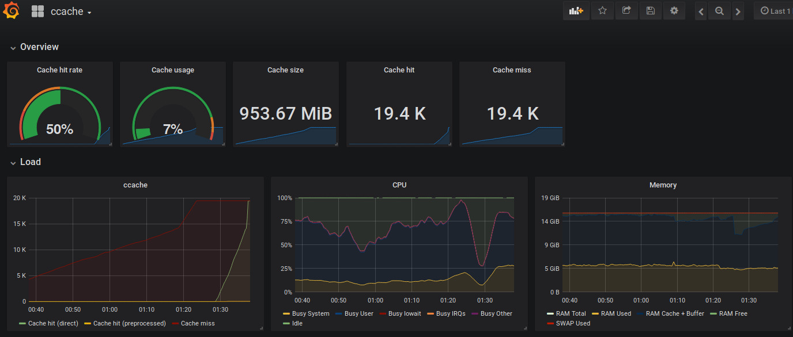

# ccache parser and Prometheus exporter


A [Prometheus](https://prometheus.io/) exporter for the [ccache](https://ccache.dev/)
compiler cache statistics, and its companion Go parser.

## Exposed Metrics
### Internal
| Metric                                  | Type    | Labels                                         |
| --------------------------------------- | ------- | ---------------------------------------------- |
| `ccache_collector_parsing_errors_total` | Counter | -                                              |
| `ccache_exporter_version`               | Untyped | committed_at_seconds,is_dirty,revision,version |
| `ccache_version`                        | Untyped | version                                        |

### ccache
> [!TIP]
> For details about each metric, see the [Cache statistics](https://ccache.dev/manual/latest.html#_cache_statistics)
> section of the [ccache(1) manual](https://ccache.dev/manual/latest.html).

> [!WARNING]
> Depending on the version of the local `ccache` binary, some metrics may not be available.
> See the [ccache release notes](https://ccache.dev/releasenotes.html) for more information.


| Metric                                    | Type    | Labels |
| ----------------------------------------- | ------- | ------ |
| `ccache_call_total`                       | Counter | -      |
| `ccache_call_hit_total`                   | Counter | mode   |
| `ccache_called_for_link_total`            | Counter | -      |
| `ccache_called_for_preprocessing_total`   | Counter | -      |
| `ccache_cleanups_performed_total`         | Counter | -      |
| `ccache_compilation_failed_total`         | Counter | -      |
| `ccache_no_input_file_total`              | Counter | -      |
| `ccache_preprocessing_failed_total`       | Counter | -      |
| `ccache_remote_storage_errors_total`      | Counter | -      |
| `ccache_remote_storage_hit_total`         | Counter | -      |
| `ccache_remote_storage_miss_total`        | Counter | -      |
| `ccache_remote_storage_read_hit_total`    | Counter | -      |
| `ccache_remote_storage_read_miss_total`   | Counter | -      |
| `ccache_remote_storage_timeout_total`     | Counter | -      |
| `ccache_remote_storage_write_total`       | Counter | -      |
| `ccache_unsupported_code_directive_total` | Counter | -      |
| `ccache_cache_hit_ratio`                  | Gauge   | -      |
| `ccache_cache_size_bytes`                 | Gauge   | -      |
| `ccache_cache_size_max_bytes`             | Gauge   | -      |
| `ccache_cached_files`                     | Gauge   | -      |


## Parser usage

For ccache 3.7 and above:

```shell
$ ccache --print-stats | ccacheparser | jq
```

```json
{
  "stats_time": "2022-07-31T20:39:33Z",
  "stats_zero_time": "2022-07-29T17:04:53Z",
  "cache_hit_direct": 192,
  "cache_hit_preprocessed": 2,
  "cache_miss": 535,
  "cache_miss_direct": 276,
  "cache_miss_preprocessed": 259,
  "cache_hit_rate": 26.611796982167352,
  "cache_hit_ratio": 0.2661179698216735,
  "called_for_link": 132,
  "called_for_preprocessing": 0,
  "unsupported_code_directive": 0,
  "no_input_file": 13,
  "cleanups_performed": 0,
  "files_in_cache": 508,
  "cache_size": "8MB",
  "cache_size_bytes": 8159232
}
```

## Running the demo with Docker Compose

The provided `docker-compose.yml` script defines the following monitoring
stack:

- `ccache-exporter` service bind-mounted on the user's `$HOME` directory;
- `node-exporter` service to gather system metrics;
- `prometheus` database, preconfigured to scrap exported `ccache` metrics;
- `grafana` dashboard, preconfigured to use `prometheus` as a data source
  and display `ccache` metrics in the corresponding dashboard.


To pull Docker images and start the services:

```shell
$ docker-compose pull
$ docker-compose up -d
```

Once the stack is up, the following services will be exposed:

- http://localhost:19508: `ccache-exporter`
- http://localhost:19100: `node-exporter`
- http://localhost:19090: `prometheus`
- http://localhost:13000: `grafana`


Then, login to Grafana with the default credentials (`admin/admin`) and load
the `ccache` dashboard:



## Change Log
See [CHANGELOG](./CHANGELOG.md)

## Contributing
See [CONTRIBUTING](./CONTRIBUTING.md)

## License
`ccache_exporter` is licenced under the MIT License.
