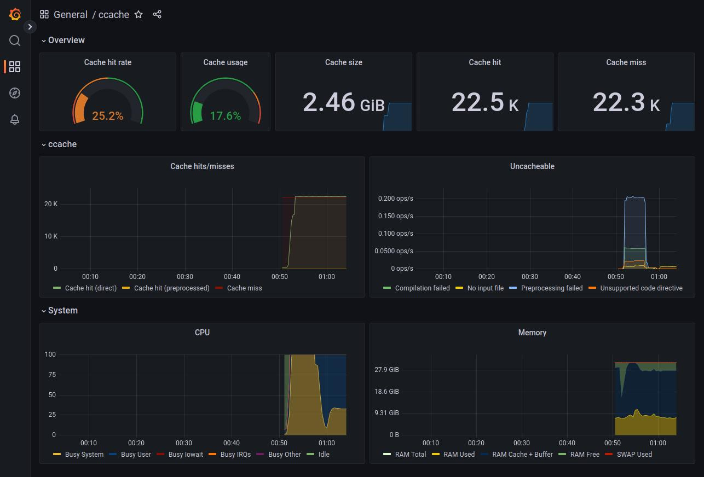

# ccache parser and Prometheus exporter


A [Prometheus](https://prometheus.io/) exporter for the
[ccache](https://ccache.dev/) compiler cache statistics, and its companion Go
parser.

## Metrics exposed

Counters (internal):

- `ccache_collector_parsing_errors_total`

Counters (ccache):

- `ccache_call_total`
- `ccache_call_hit_total`
- `ccache_called_for_link_total`
- `ccache_called_for_preprocessing_total`
- `ccache_cleanups_performed_total`
- `ccache_no_input_file_total`
- `ccache_unsupported_code_directive_total`


Gauges (ccache):

- `ccache_cache_hit_ratio`
- `ccache_cache_size_bytes`
- `ccache_cache_size_max_bytes`
- `ccache_cached_files`

## Building

Get the sources:

```shell
$ git clone https://github.com/virtualtam/ccache_exporter.git
$ cd ccache_exporter
```

Run linters:
```shell
$ make lint
```

Build the parser and exporter:

```shell
$ make build
```

Build platform-specific binaries with [Promu](https://github.com/prometheus/promu):

```shell
$ promu crossbuild
```

Parser usage
------------

For ccache 3.7 and above:

```shell
$ ccache --print-stats | ccacheparser | jq
```

```json
{
  "stats_time": "2022-07-31T20:39:33Z",
  "stats_zero_time": "2022-07-29T17:04:53Z",
  "cache_hit_direct": 192,
  "cache_hit_preprocessed": 2,
  "cache_miss": 535,
  "cache_miss_direct": 276,
  "cache_miss_preprocessed": 259,
  "cache_hit_rate": 26.611796982167352,
  "cache_hit_ratio": 0.2661179698216735,
  "called_for_link": 132,
  "called_for_preprocessing": 0,
  "unsupported_code_directive": 0,
  "no_input_file": 13,
  "cleanups_performed": 0,
  "files_in_cache": 508,
  "cache_size": "8MB",
  "cache_size_bytes": 8159232
}
```

## Running the demo with Docker Compose

The provided `docker-compose.yml` script defines the following monitoring
stack:

- `ccache-exporter` service bind-mounted on the user's `$HOME` directory;
- `node-exporter` service to gather system metrics;
- `prometheus` database, preconfigured to scrap exported `ccache` metrics;
- `grafana` dashboard, preconfigured to use `prometheus` as a data source
  and display `ccache` metrics in the corresponding dashboard.


To pull Docker images and start the services:

```shell
$ docker-compose pull
$ docker-compose up -d
```

Once the stack is up, the following services will be exposed:

- http://localhost:19508: `ccache-exporter`
- http://localhost:19100: `node-exporter`
- http://localhost:19090: `prometheus`
- http://localhost:13000: `grafana`


Then, login to Grafana with the default credentials (`admin/admin`) and load
the `ccache` dashboard:



## Change Log

See [CHANGELOG](./CHANGELOG.md)

## License

`ccache_exporter` is licenced under the MIT License.
